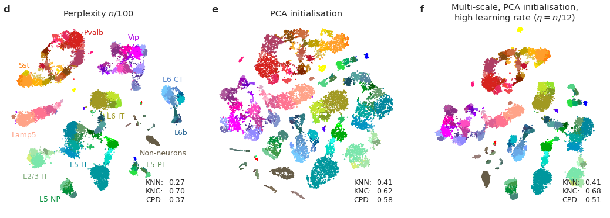

# The art of using t-SNE for single-cell transcriptomics

This is a companion repository to our paper https://www.nature.com/articles/s41467-019-13056-x (Kobak & Berens 2019, The art of using t-SNE for single-cell transcriptomics). All code is in Python Jupyter notebooks. We used this t-SNE implementation: https://github.com/KlugerLab/FIt-SNE.

See [`demo.ipynb`](https://github.com/berenslab/rna-seq-tsne/blob/master/demo.ipynb) for a step-by-step guide using a data set from Tasic et al., Nature 2018 (24,000 cells sequenced with Smart-seq2).

The preprocessed data from Tasic et al. (after library size normalization, log-transformation, highly variable gene selection and reduction to 50 dimensions with PCA) are available in `data/tasic-preprocessed` as the 50-dimensional data matrix and an array of point colors.

The other notebooks generate all figures that we have in the paper:

* [`toy-example.ipynb`](https://github.com/berenslab/rna-seq-tsne/blob/master/toy-example.ipynb)
* [`tasic-et-al.ipynb`](https://github.com/berenslab/rna-seq-tsne/blob/master/tasic-et-al.ipynb)
* [`umi-datasets.ipynb`](https://github.com/berenslab/rna-seq-tsne/blob/master/umi-datasets.ipynb)
* [`million-cells.ipynb`](https://github.com/berenslab/rna-seq-tsne/blob/master/million-cells.ipynb)
* [`two-million-cells.ipynb`](https://github.com/berenslab/rna-seq-tsne/blob/master/two-million-cells.ipynb)
* [`umap-comparison.ipynb`](https://github.com/berenslab/rna-seq-tsne/blob/master/umap-comparison.ipynb)

The last three notebooks require one to run `server-10xdata.py` and `server-cao.py`. One needs more than 32 Gb of RAM to process these datasets conveniently, so these Python scripts were run separately on a powerful machine. They pickle all the results (t-SNE embeddings). Unfortunately, these pickles are too large to be shared on Github. 
